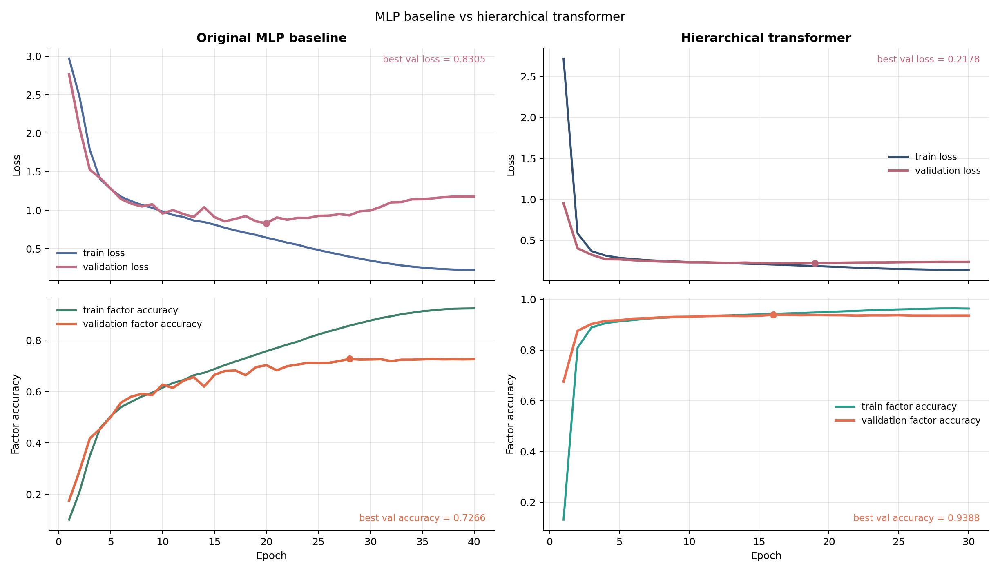
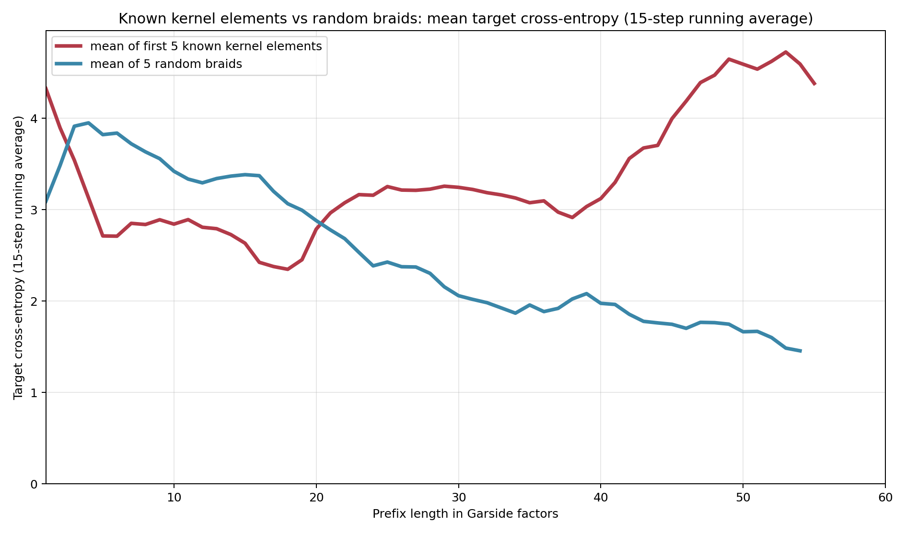
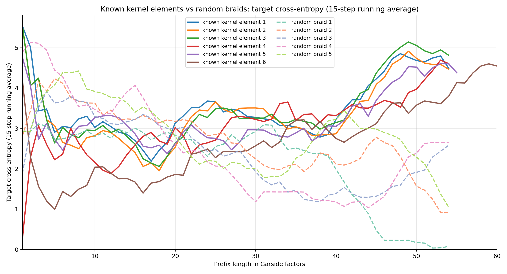
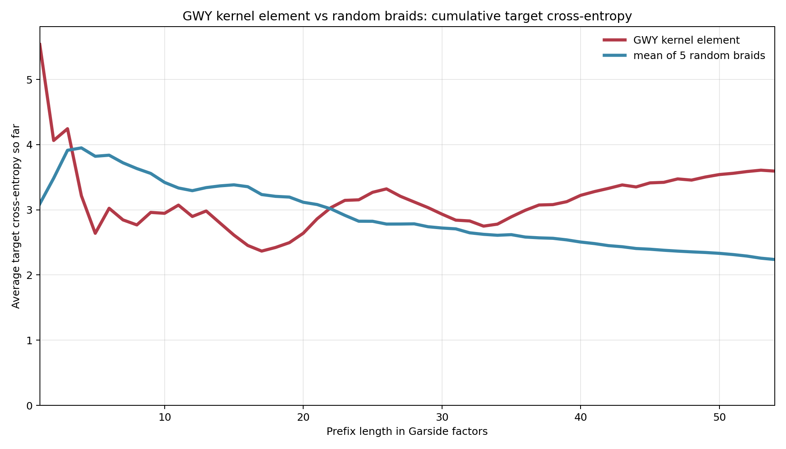
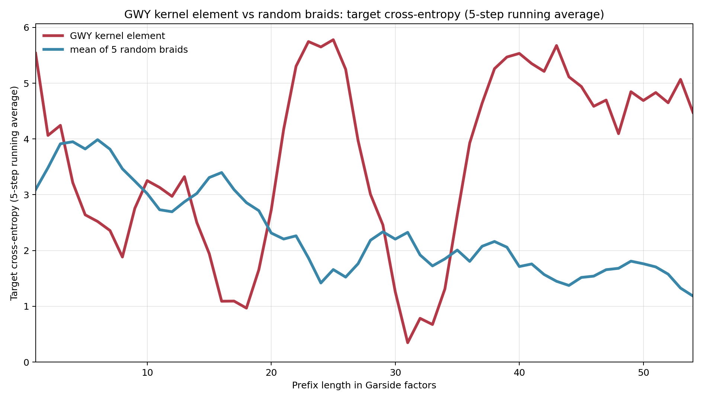
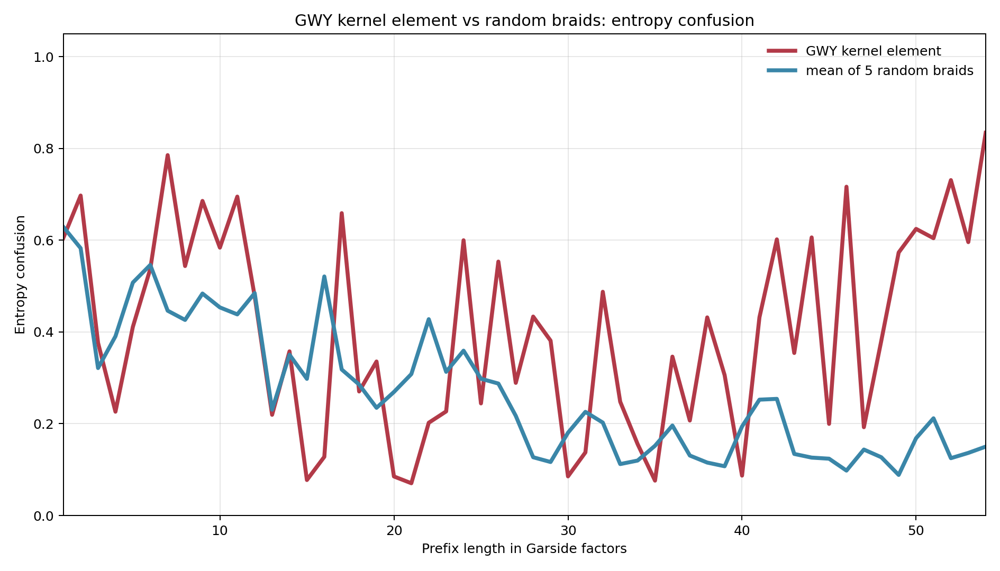

# braidmod

`braidmod` is a repo about the four-strand Burau faithfulness
problem and a new machine-learning strategy for attacking it in characteristic
`p`.

The central idea is simple:

1. do **not** train a model to predict kernel membership directly
2. train it instead to recover a genuine algebraic feature from the Burau matrix
3. treat the model's failure mode, or **model confusion**, as a search signal

In this repo the supervised target is the final Garside factor of the braid's
left normal form. The input is the full projectively normalized Burau tensor,
kept as a polynomial object modulo `p` rather than specialized to isolated
numerical values of the indeterminate.



## Mathematical background

The reduced Burau representation is one of the classical linear representations
of braid groups. In characteristic zero, the broad faithfulness picture is known:

- it is faithful for `B_n` with `n <= 3`
- it is unfaithful for `B_n` with `n >= 5`
- the remaining classical open case is `B_4`

That remaining `B_4` case is especially important because it is tied to the
Jones unknot problem for closed four-braids and has served for decades as a
testing ground for both topology and computation.

Modulo primes, the four-strand problem has its own life:

- Cooper and Long analyzed the reduced Burau representation modulo small
  primes in the late 1990s, with nonfaithfulness already visible modulo `2` and
  a kernel exhibited modulo `3`
- Gibson, Williamson, and Yacobi later proved that four-strand Burau is
  unfaithful modulo `5`
- at the time of writing, no kernel elements are known
  modulo primes `p >= 7`

So characteristic `p` is not merely a toy shadow of the classical problem. It is
already interesting in its own right, and higher primes remain almost completely
unexplored.

## Prior computational work

The strategy in this repo extends two distinct ideas from earlier work.

### 1. Reservoir-sampling search

In the `mod 5` paper of Gibson, Williamson, and Yacobi, the key search engine
was a reservoir-sampling method for exploring enormous streams of braid
candidates while retaining only promising survivors. That paper did **not** use
neural networks, but it introduced the search framework that makes large-scale
kernel hunting practical.

### 2. Descent-set confusion

More recently, Williamson has described an ongoing neural-search program with
François Charton, Ashvni Narayanan, and Oded Yacobi, building on earlier work
with Gibson and Yacobi, in which a neural network is trained to predict the
right descent set of the rightmost Garside factor. The `l^1` gap between the
prediction and reality is then used as a score function:

- ordinary braids should look predictable
- unusual braids should induce larger error
- large error, or **descent-set confusion**, becomes a search heuristic

In the motivating experiments behind this repo, the Burau matrix is treated
through specializations of the indeterminate rather than as a full Laurent
polynomial matrix.

## What is new here

This repository is a new step in that program.

Here, we combine the model-confusion idea
with the characteristic-`p` Burau problem while feeding the model the **entire**
polynomial Burau matrix.

More specifically, this repo changes three things at once:

- it moves from characteristic zero to characteristic `p`
- it moves from specialized evaluations of the Burau matrix to the full
  polynomial tensor
- it moves from predicting only a descent set to predicting the **actual final
  Garside factor**

The final Garside factor is a richer target than its
descent set: the descent set is a coarse shadow of the factor, while the factor
itself is a `24`-class object in type `A_3`.

## What this repo shows

Our experiments suggest that a model can learn honest algebraic
structure from Burau matrices in characteristic `p`, and its uncertainty on
prefixes can then be reused as a kernel-search signal.

Concretely:

- the original MLP already learns nontrivial last-factor structure from the Burau
  tensor
- a polynomial-aware transformer improves that prediction problem
  substantially
- the improved model still fails in a structured way on known kernel elements,
  and that failure is visible in the confusion-score plots

That is the conceptual point of the project. Following the (brilliant!) idea of Charton, Narayanan, Williamson, and Yacobi, we are training a structural predictor and then using its surprise (or "confusion") as
the downstream mathematical signal in our kernel search.

## Results

| Result | Public number |
| --- | --- |
| MLP validation factor accuracy | `0.7266` |
| Transformer validation loss | `0.2178` |
| Transformer validation factor accuracy | `0.9388` |

The specialized-value descent-set experiments were already strong enough to make
model confusion interesting, with accuracy in roughly the `80%` range on that
coarser task. Here our best transformer reaches `93.88%` validation
accuracy on the finer `24`-class final-factor problem while operating directly on
the full characteristic-`p` polynomial tensor.

Just as importantly, this transformer is not only a cleaner fit to the
supervised task. It also preserves the qualitative behavior we want on saved
kernel examples:

- averaged kernel-hit curves stay well above random controls under smoothing
  windows `7`, `10`, `15`, and `20`
- the individual kernel-hit trajectories remain visibly elevated, so the effect is
  not created by averaging alone
- the known mod 5 kernel element found by Gibson, Williamson, Yacobi (we call it the GWY element) shows the same pattern most clearly in cross-entropy with the target prediction

Here are three figures summarizing the repo:

- [figures/mlp_and_transformer_training_curves.png](figures/mlp_and_transformer_training_curves.png)
- [figures/known_kernel_elements_vs_random_target_cross_entropy_running_average_15_steps.png](figures/known_kernel_elements_vs_random_target_cross_entropy_running_average_15_steps.png)
- [figures/gwy_kernel_element_vs_random_cumulative_target_cross_entropy.png](figures/gwy_kernel_element_vs_random_cumulative_target_cross_entropy.png)

## Why this matters for higher primes

The real long-term use case is not `p = 5`, where kernel elements are already
known. The real target is `p = 7`, `11`, and beyond, where we currently have no
known kernel elements to aim at.

The confusion-score evolution plots in this repo are evidence that the idea is
not confined to characteristic zero. Even in characteristic `p`, a model trained
only on ordinary Garside data assigns systematically higher surprise to known
kernel prefixes than to random controls. That's the kind of information we want to include inside a reservoir-sampling search:

- score prefixes by how atypical they look to the model
- keep only a small weighted reservoir of promising candidates
- spend computation on the part of braid space that looks algebraically strange

If that phenomenon persists at higher primes, then confusion-guided reservoir
sampling could substantially prune the search and make new kernel discoveries
far more realistic.

## Model comparison

| Line of work | Representation seen by the model | Prediction target | Search role |
| --- | --- | --- | --- |
| Gibson–Williamson–Yacobi mod `5` search | no neural model | none | reservoir sampling discovers kernel elements |
| Earlier neural descent-set program | specialized Burau evaluations | right descent set of rightmost Garside factor | descent-set confusion guides search |
| This repo | full mod-`p` polynomial Burau tensor | actual final Garside factor | model confusion is designed to plug into reservoir search |

## Architecture

### Shared representation

Both public models consume the same structured tensor:

- shape: `D x 3 x 3`
- entries: coefficients mod `p`
- extra scalar feature: `burau_min_degree`
- target class: one of the `24` permutations in `S_4`

The dataset zero-pads the polynomial out to the fixed training depth `D`. The
transformer infers a valid-degree mask from the last occupied degree, so
internal zero slices remain legal while trailing padding is ignored.

### Original MLP baseline

The MLP is deliberately simple.

1. Embed every coefficient by value, degree, row, and column.
2. Flatten the full tensor.
3. Project once into a hidden state.
4. Add a projected `burau_min_degree` feature.
5. Apply residual feedforward blocks.
6. Predict the final factor, optionally with an auxiliary descent head.

This baseline matters because it proves the task is real. The Burau matrix is
already informative enough that a straightforward network can recover a large
amount of last-factor structure.

### Hierarchical transformer

The transformer keeps the architecture aligned with the object being modeled.

#### Local stage

For each occupied degree, the model builds `9` tokens, one for each entry of
the `3 x 3` matrix. Each token is the sum of:

- a mod-`p` value embedding
- a row embedding
- a column embedding
- a local degree embedding

A learned local CLS token is prepended to that slice, and the slice is processed
by:

- `2` local transformer blocks
- `4` attention heads per block
- feedforward width multiplier `4`

The local CLS output becomes the summary for that degree.

#### Global stage

Those degree summaries form a second sequence. The global encoder adds:

- a learned global CLS token
- a separate global degree embedding
- `6` global transformer blocks
- `8` attention heads per block

The projected `burau_min_degree` scalar is added as a bias to the global CLS
token. The final public model is factor-only: no Garside-length conditioning and
no auxiliary descent loss.

#### Final head

The global CLS representation is layer-normalized and sent to a `24`-way linear
classifier for the final Garside factor.

### Why this transformer is better than the MLP

The important difference is not that the transformer is simply "newer." It is
that it respects the tensor's hierarchy.

- The MLP only sees structure after flattening.
- The transformer first learns interactions within one degree slice.
- Then it learns interactions across degrees.
- It can ignore padded tail degrees through the inferred mask.

So the inductive bias matches the data much better. That is why the validation
gap is so large, and it is also why the confusion curves remain clean rather
than collapsing into noise.

## Figure gallery

The full figure inventory is documented in [figures/README.md](figures/README.md).
The main public story uses four groups of plots.

### 1. Training behavior


This is the cleanest first figure for the repo. It shows the original MLP and
the final transformer side by side, with both training and validation behavior
visible in one place.

### 2. Known-kernel vs random controls




These are the main confusion-score figures for the public story. The first plot
compares the mean of the first five known kernel elements to the mean of five
random braids under a 15-step running average of target cross-entropy. The
second shows the individual known-kernel trajectories against the same random
controls, making clear that the effect is not created by averaging alone.

### 3. GWY kernel element case study





These plots focus on the GWY kernel element found by Gibson, Williamson, and
Yacobi. The target cross-entropy curves are the clearest evidence that model
confusion is predictive in characteristic `p`; entropy is a weaker but still
visible secondary signal.

## Background references

- [Cooper–Long, *A presentation for the image of Burau(4) ⊗ Z2* (1997)](https://web.math.ucsb.edu/~long/pubpdf/modtwo.pdf)
- [Cooper–Long, *On the Burau representation modulo a small prime* (1998)](https://web.math.ucsb.edu/~cooper/30.pdf)
- [Gibson–Williamson–Yacobi, *4-Strand Burau is Unfaithful Modulo 5* (arXiv:2310.02403)](https://arxiv.org/abs/2310.02403)
- [Geordie Williamson papers page, noting that the mod-5 work introduced a reservoir-sampling search method](https://www.maths.usyd.edu.au/u/geordie/papers.html)
- [Williamson, *Using neural networks to search for interesting mathematical objects* (2025 slides)](https://www.maths.usyd.edu.au/u/geordie/JMM/JMM3.pdf)
- [Yacobi, *A computational perspective on the Burau representation* (UNSW seminar abstract, June 11, 2024)](https://www.unsw.edu.au/science/our-schools/maths/engage-with-us/seminars/2024/A-computational-perspective-on-the-Burau-representation)

## Start here

- `docs/model_confusion.md`
  Public writeup of the core idea and the main plots.
- `checkpoints/`
  Public model artifacts, logs, and training curves.
- `figures/`
  Curated plots for the public story.
- `figures/README.md`
  Short guide to what each public figure is showing.
- `jobs/`
  Clean cluster entrypoints for dataset generation, training, figure rendering,
  and search.

## Repository tour

- `braid_data.py`
  Garside normal form utilities, Burau evaluation, and dataset construction.
- `generate_dataset.py`
  CLI for generating Burau/Garside training data.
- `train_garside_mlp.py`
  Unified trainer for the original MLP and the final transformer.
- `garside_models.py`, `garside_transformer.py`
  Public model definitions and checkpoint-aware construction.
- `predict_garside_mlp.py`
  Inference CLI for saved checkpoints.
- `reservoir_search_braidmod.py`
  Search that combines projective length and model-confusion scores.
- `plot_prefix_confusion.py`, `track_confusion_prefix.py`,
  `render_kernel_random_xent_overlay.py`,
  `render_average_kernel_random_xent_overlay.py`
  Prefix-confusion analysis and figure generation.
- `figure_data/`
  Tracked JSON inputs used to reproduce the public confusion figures.
- `prototypes/`
  Archived experiments, historical cluster wrappers, and research backlog.

## Quick start

Create an environment:

```bash
python -m venv .venv
.venv/bin/python -m pip install -r requirements-ml.txt
```

Generate the reference dataset locally:

```bash
.venv/bin/python generate_dataset.py \
  --output-path data/generated/burau_gnf_L30to60_p5_D140_N200000_uniform_corrected.json \
  --num-samples 200000 \
  --length-min 30 \
  --length-max 60 \
  --p 5 \
  --D 140
```

Train the original MLP baseline:

```bash
.venv/bin/python train_garside_mlp.py \
  --data-path data/generated/burau_gnf_L30to60_p5_D140_N200000_uniform_corrected.json \
  --p 5 \
  --task multitask \
  --batch-size 512 \
  --epochs 40 \
  --embed-dim 32 \
  --hidden-dim 1024 \
  --blocks 3 \
  --dropout 0.1 \
  --aux-weight 0.2 \
  --out-dir artifacts/public_original_mlp
```

Train the best transformer:

```bash
.venv/bin/python train_garside_mlp.py \
  --data-path data/generated/burau_gnf_L30to60_p5_D140_N200000_uniform_corrected.json \
  --p 5 \
  --model-type transformer \
  --task final_factor \
  --batch-size 256 \
  --epochs 30 \
  --d-model 256 \
  --ffn-mult 4 \
  --num-local-blocks 2 \
  --num-local-heads 4 \
  --num-global-blocks 6 \
  --num-global-heads 8 \
  --dropout 0.05 \
  --label-smoothing 0.03 \
  --selection-objective loss \
  --out-dir artifacts/public_best_transformer
```

Run model-confusion search:

```bash
.venv/bin/python reservoir_search_braidmod.py \
  --p 5 \
  --max-length 60 \
  --bucket-size 100000 \
  --use-best 300000 \
  --bootstrap-length 5 \
  --num-buckets 100 \
  --score-type frontier_target_xent \
  --checkpoint checkpoints/best_transformer/best_model.pt \
  --device cuda \
  --out-json artifacts/public_frontier_search.json
```

Render the public averaged kernel-vs-random confusion curves:

```bash
.venv/bin/python render_average_kernel_random_xent_overlay.py \
  --search-json figure_data/search/kernel_hits_len60.json \
  --checkpoint checkpoints/best_transformer/best_model.pt \
  --suite-dir figure_data/confusion_suite_tuned \
  --out-png figures/generated/known_kernel_elements_vs_random_target_cross_entropy_running_average_15_steps.png \
  --device cuda \
  --mode avg5 \
  --window 15 \
  --max-length 60 \
  --num-kernels 5
```

Or render the full public figure story in one Slurm job:

```bash
sbatch jobs/render_public_story_figures.sh
```

## Public artifacts

### Baseline MLP

- curves: `checkpoints/original_mlp/training_curves.png`
- log: `checkpoints/original_mlp/train.log`
- headline validation accuracy: `0.7266`

The raw MLP checkpoint is intentionally omitted from GitHub. The public repo
keeps the log, the curves, and the exact training recipe needed to regenerate
it.

### Best transformer

- checkpoint: `checkpoints/best_transformer/best_model.pt`
- curves: `checkpoints/best_transformer/training_curves.png`
- comparison plot: `checkpoints/best_transformer/mlp_vs_transformer_validation.png`
- headline validation loss: `0.2178`
- headline validation factor accuracy: `0.9388`

### Public figure set

- `figures/mlp_and_transformer_training_curves.png`
- `figures/mlp_training_curves.png`
- `figures/transformer_training_curves.png`
- `figures/mlp_vs_transformer_validation.png`
- `figures/known_kernel_elements_vs_random_target_cross_entropy_running_average_15_steps.png`
- `figures/individual_known_kernel_elements_vs_random_target_cross_entropy_running_average_15_steps.png`
- `figures/gwy_kernel_element_vs_random_cumulative_target_cross_entropy.png`
- `figures/gwy_kernel_element_vs_random_target_cross_entropy_running_average_5_steps.png`
- `figures/gwy_kernel_element_vs_random_entropy_confusion.png`

## Data policy

The repository tracks small figure inputs and the public transformer checkpoint,
but not the large generated training corpora. Put regenerated datasets under
`data/generated/`. See `data/README.md` for the default paths and regeneration
commands.

## Cluster use

If you are running on Yale Bouchet, use the curated scripts in `jobs/`. Older
experiment-specific wrappers are archived under `prototypes/slurm/`.

## License

This repository is released under the MIT License. See `LICENSE`.
