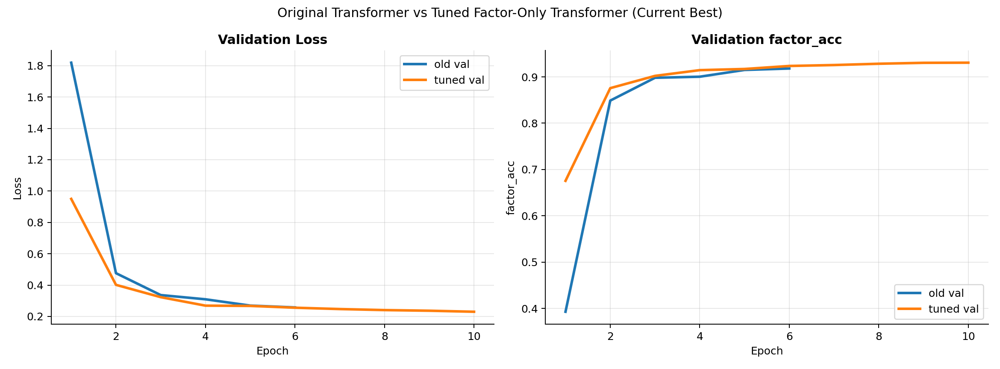
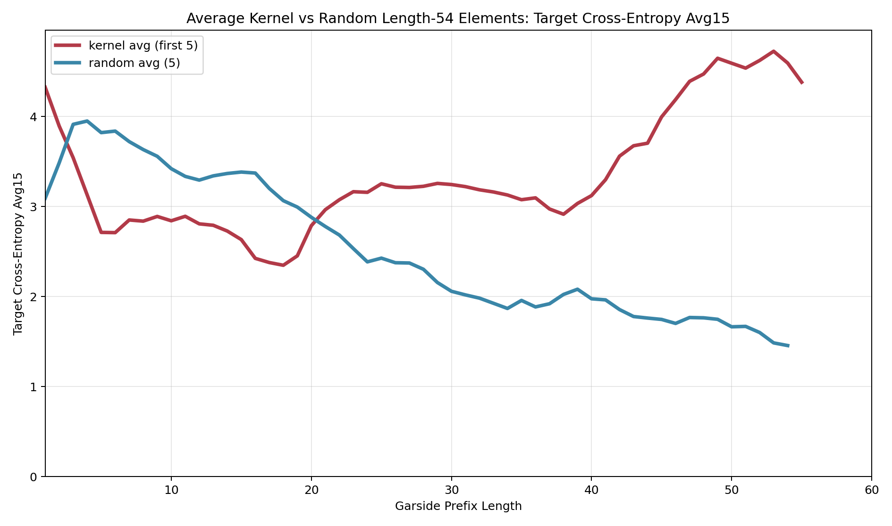

# braidmod

`braidmod` studies a simple strategy for probing the kernel of the reduced
Burau representation in `B_4` mod `p`:

1. Train on an algebraic prediction problem that does **not** use kernel labels.
2. Evaluate the model along prefixes of candidate braids.
3. Use model confusion as a statistical signal for search.

The supervised task is:

- input: a projectively normalized Burau tensor
- label: the final Garside factor of the braid's left normal form

The baseline model is an MLP. The strongest public model is a hierarchical
transformer that encodes local structure inside each `3 x 3` degree slice and
then aggregates across degrees.




## Why this is interesting

The kernel problem is hard. Instead of training a classifier to say "kernel" or
"not kernel", this repo trains models to infer honest algebraic structure from
Burau matrices. The working hypothesis is:

- ordinary braids should look structurally predictable
- kernel-like prefixes should look atypical
- that atypicality should show up as target surprise or uncertainty
- a search procedure can exploit that signal without direct kernel supervision

This turns model failure into a mathematical tool.

## Headline results

- original MLP validation factor accuracy: `0.7266`
- best transformer validation loss: `0.2178`
- best transformer validation factor accuracy: `0.9388`
- saved kernel prefixes remain statistically separated from random braids by
  smoothed target cross-entropy

The two most presentation-ready figures are:

- [figures/kernel_avg_first5_vs_random_avg15.png](figures/kernel_avg_first5_vs_random_avg15.png)
- [figures/geordie_vs_random_cumulative_xent.png](figures/geordie_vs_random_cumulative_xent.png)

## Start here

- `docs/model_confusion.md`
  Public writeup of the core idea and the main plots.
- `checkpoints/`
  Public model artifacts, logs, and training curves.
- `figures/`
  Curated plots for the public story.
- `jobs/`
  Clean cluster entrypoints for dataset generation, training, figure rendering,
  and search.

## Repository tour

- `braid_data.py`
  Garside normal form utilities, Burau evaluation, and dataset construction.
- `generate_dataset.py`
  CLI for generating Burau/Garside training data.
- `train_garside_mlp.py`
  Unified trainer for the original MLP and the final transformer.
- `garside_models.py`, `garside_transformer.py`
  Public model definitions and checkpoint-aware construction.
- `predict_garside_mlp.py`
  Inference CLI for saved checkpoints.
- `reservoir_search_braidmod.py`
  Search that combines projective length and model-confusion scores.
- `plot_prefix_confusion.py`, `track_confusion_prefix.py`,
  `render_kernel_random_xent_overlay.py`,
  `render_average_kernel_random_xent_overlay.py`
  Prefix-confusion analysis and figure generation.
- `figure_data/`
  Tracked JSON inputs used to reproduce the public confusion figures.
- `prototypes/`
  Archived experiments, historical cluster wrappers, and research backlog.

## Quick start

Create an environment:

```bash
python -m venv .venv
.venv/bin/python -m pip install -r requirements-ml.txt
```

Generate the reference dataset locally:

```bash
.venv/bin/python generate_dataset.py \
  --output-path data/generated/burau_gnf_L30to60_p5_D140_N200000_uniform_corrected.json \
  --num-samples 200000 \
  --length-min 30 \
  --length-max 60 \
  --p 5 \
  --D 140
```

Train the original MLP baseline:

```bash
.venv/bin/python train_garside_mlp.py \
  --data-path data/generated/burau_gnf_L30to60_p5_D140_N200000_uniform_corrected.json \
  --p 5 \
  --task multitask \
  --batch-size 512 \
  --epochs 40 \
  --embed-dim 32 \
  --hidden-dim 1024 \
  --blocks 3 \
  --dropout 0.1 \
  --aux-weight 0.2 \
  --out-dir artifacts/public_original_mlp
```

Train the best transformer:

```bash
.venv/bin/python train_garside_mlp.py \
  --data-path data/generated/burau_gnf_L30to60_p5_D140_N200000_uniform_corrected.json \
  --p 5 \
  --model-type transformer \
  --task final_factor \
  --batch-size 256 \
  --epochs 30 \
  --d-model 256 \
  --ffn-mult 4 \
  --num-local-blocks 2 \
  --num-local-heads 4 \
  --num-global-blocks 6 \
  --num-global-heads 8 \
  --dropout 0.05 \
  --label-smoothing 0.03 \
  --selection-objective loss \
  --out-dir artifacts/public_best_transformer
```

Run model-confusion search:

```bash
.venv/bin/python reservoir_search_braidmod.py \
  --p 5 \
  --max-length 60 \
  --bucket-size 100000 \
  --use-best 300000 \
  --bootstrap-length 5 \
  --num-buckets 100 \
  --score-type frontier_target_xent \
  --checkpoint checkpoints/best_transformer/best_model.pt \
  --device cuda \
  --out-json artifacts/public_frontier_search.json
```

Render the public averaged kernel-vs-random confusion curves:

```bash
.venv/bin/python render_average_kernel_random_xent_overlay.py \
  --search-json figure_data/search/kernel_hits_len60.json \
  --checkpoint checkpoints/best_transformer/best_model.pt \
  --suite-dir figure_data/confusion_suite_tuned \
  --out-png figures/generated/kernel_avg_first5_vs_random_avg_target_xent_avg15.png \
  --device cuda \
  --mode avg5 \
  --window 15 \
  --max-length 60 \
  --num-kernels 5
```

## Public artifacts

### Baseline MLP

- curves: `checkpoints/original_mlp/training_curves.png`
- log: `checkpoints/original_mlp/train.log`
- headline validation accuracy: `0.7266`

The raw MLP checkpoint is intentionally omitted from GitHub. The public repo
keeps the log, the curves, and the exact training recipe needed to regenerate
it.

### Best transformer

- checkpoint: `checkpoints/best_transformer/best_model.pt`
- curves: `checkpoints/best_transformer/training_curves.png`
- comparison plot: `checkpoints/best_transformer/mlp_vs_transformer_validation.png`
- headline validation loss: `0.2178`
- headline validation factor accuracy: `0.9388`

### Public figure set

- `figures/kernel_avg_first5_vs_random_avg10.png`
- `figures/kernel_avg_first5_vs_random_avg15.png`
- `figures/kernel_hits_vs_random_avg10.png`
- `figures/geordie_vs_random_cumulative_xent.png`
- `figures/geordie_entropy_confusion.png`

## Data policy

The repository tracks small figure inputs and the public transformer checkpoint,
but not the large generated training corpora. Put regenerated datasets under
`data/generated/`. See `data/README.md` for the default paths and regeneration
commands.

## Cluster use

If you are running on Yale Bouchet, use the curated scripts in `jobs/`. Older
experiment-specific wrappers are archived under `prototypes/slurm/`.

## License

This repository is released under the MIT License. See `LICENSE`.
