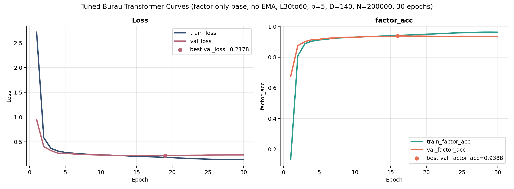
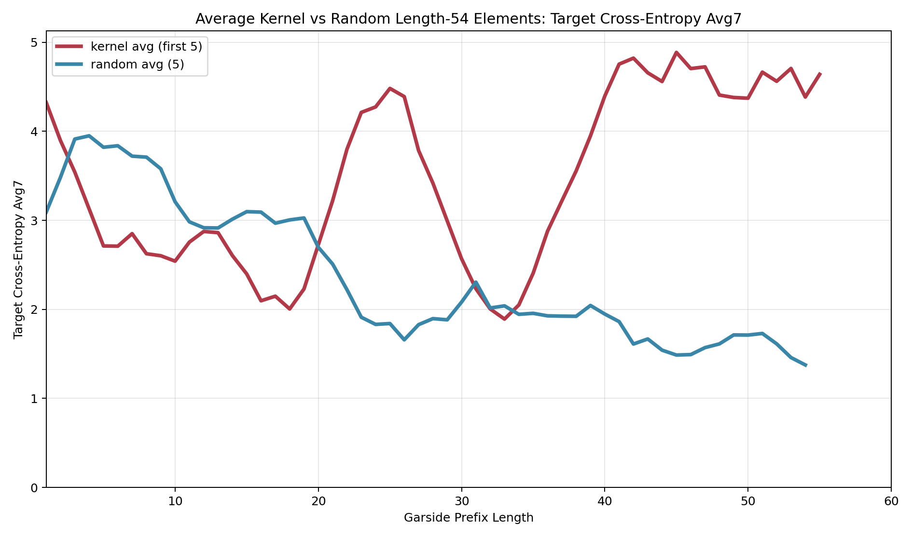
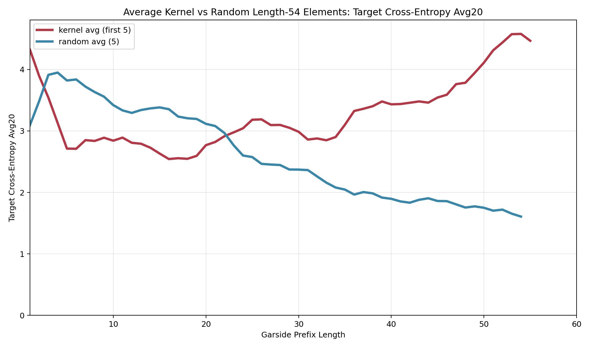
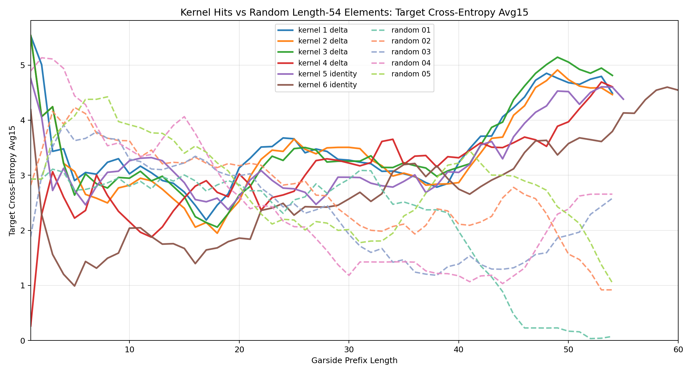
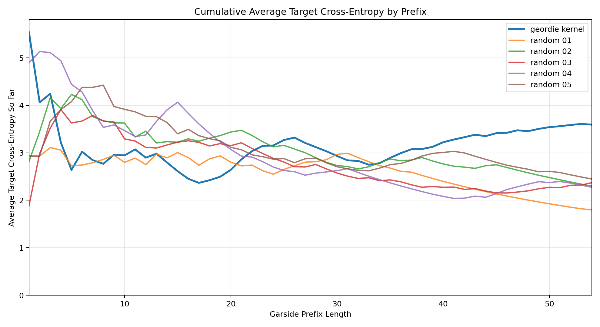
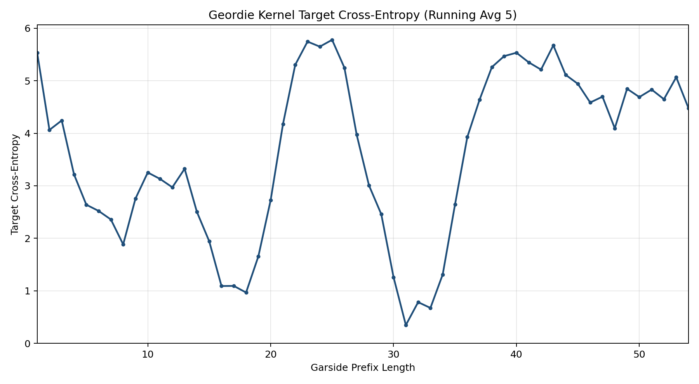
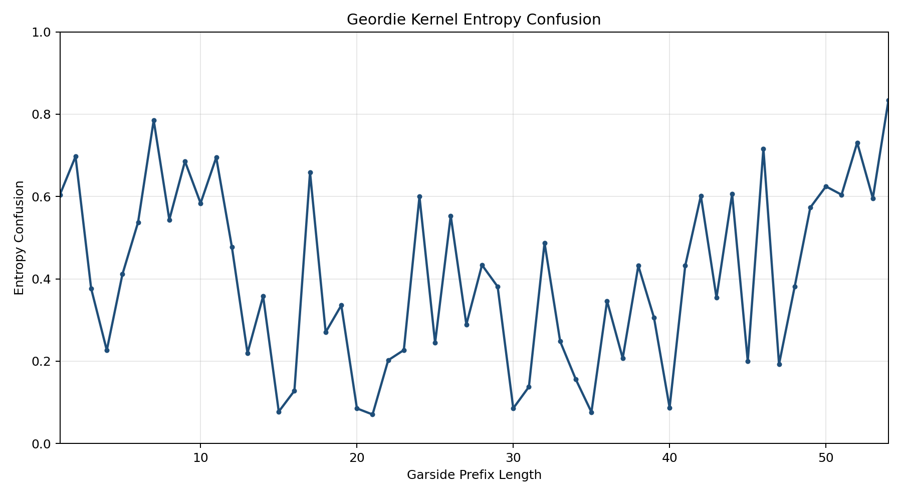

# braidmod

`braidmod` is a public research repo about a simple idea for the reduced Burau
representation in `B_4` mod `p`:

1. train on an algebraic task that does **not** use kernel labels
2. evaluate the model along prefixes of candidate braids
3. use model confusion as a statistical guide for search

The supervised target is the final Garside factor of the braid's left normal
form. The input is a projectively normalized Burau tensor. The public models
are an original MLP baseline and a stronger hierarchical transformer.


## What this repo shows

This repository is built around one claim: a model can learn honest algebraic
structure from Burau matrices, and its uncertainty on prefixes can then be used
as a kernel-search signal.

More concretely:

- the original MLP already shows that the Burau tensor contains enough
  information to predict the final Garside factor nontrivially
- the hierarchical transformer improves that prediction problem
  substantially, moving from `0.7266` to `0.9388` validation factor accuracy
- the improved predictor still exposes a useful failure mode: kernel prefixes
  look systematically atypical under smoothed target cross-entropy

This is the conceptual point of the project. We are not training a kernel
classifier. We are training a structural predictor and then using model
confusion as the downstream mathematical signal.

## Results

| Result | Public number |
| --- | --- |
| MLP validation factor accuracy | `0.7266` |
| Transformer validation loss | `0.2178` |
| Transformer validation factor accuracy | `0.9388` |

The best public model is not just a cleaner fit to the training objective. It
also preserves the qualitative behavior we want on saved kernel examples:

- averaged kernel-hit curves stay well above random controls under smoothing
  windows `7`, `10`, `15`, and `20`
- the individual kernel-hit trajectories remain visibly elevated, so the effect
  is not created by averaging alone
- the saved Geordie kernel word shows the same pattern most clearly in target
  cross-entropy

The three figures that summarize the repo best are:

- [figures/mlp_vs_transformer_validation.png](figures/mlp_vs_transformer_validation.png)
- [figures/kernel_avg_first5_vs_random_avg15.png](figures/kernel_avg_first5_vs_random_avg15.png)
- [figures/geordie_vs_random_cumulative_xent.png](figures/geordie_vs_random_cumulative_xent.png)

## Why indirect supervision

The kernel problem is hard, and direct labels are not the point of the method.
Instead of asking a model to predict "kernel" or "not kernel", we ask it to
recover an algebraic feature that ordinary braids should exhibit:

- input: projectively normalized Burau tensor
- label: final Garside factor of the left normal form

Then we evaluate the trained model on prefixes and measure:

- entropy of the factor distribution
- target cross-entropy against the actual factor
- smoothed versions of those curves along a braid

That is what this repo calls model confusion.

## Architecture

### Shared representation

Both public models consume the same structured tensor:

- shape: `D x 3 x 3`
- entries: coefficients mod `p`
- extra scalar feature: `burau_min_degree`
- target class: one of the `24` permutations in `S_4`

The dataset zero-pads the polynomial out to the fixed training depth `D`. The
transformer infers a valid-degree mask from the last occupied degree, so
internal zero slices are still legal while trailing padding is ignored.

### Original MLP baseline

The MLP is deliberately simple.

1. Embed every coefficient by value, degree, row, and column.
2. Flatten the full tensor.
3. Project once into a hidden state.
4. Add a projected `burau_min_degree` feature.
5. Apply residual feedforward blocks.
6. Predict the final factor, optionally with an auxiliary descent head.

This baseline matters because it proves the task is real. The Burau matrix is
already informative enough that a straightforward network can recover a large
amount of final-factor structure.

### Hierarchical transformer

The transformer keeps the architecture aligned with the object being modeled.

#### Local stage

For each occupied degree, the model builds `9` tokens, one for each entry of
the `3 x 3` matrix. Each token is the sum of:

- a mod-`p` value embedding
- a row embedding
- a column embedding
- a local degree embedding

A learned local CLS token is prepended to that slice, and the slice is processed
by:

- `2` local transformer blocks
- `4` attention heads per block
- feedforward width multiplier `4`

The local CLS output becomes the summary for that degree.

#### Global stage

Those degree summaries form a second sequence. The global encoder adds:

- a learned global CLS token
- a separate global degree embedding
- `6` global transformer blocks
- `8` attention heads per block

The projected `burau_min_degree` scalar is added as a bias to the global CLS
token. The final public model is factor-only: no Garside-length conditioning and
no auxiliary descent loss.

#### Final head

The global CLS representation is layer-normalized and sent to a `24`-way linear
classifier for the final Garside factor.

### Why this transformer is better than the MLP

The important difference is not that the transformer is "more modern." It is
that it respects the tensor's hierarchy.

- The MLP only sees structure after flattening.
- The transformer first learns interactions within one degree slice.
- Then it learns interactions across degrees.
- It can ignore padded tail degrees through the inferred mask.

So the inductive bias matches the data much better. That is why the validation
gap is so large, and it is also why the confusion curves remain clean rather
than collapsing into noise.

## Figure gallery

The full figure inventory is documented in [figures/README.md](figures/README.md).
The main public story uses four groups of plots.

### 1. Training behavior




These show the basic modeling result: the transformer learns the factor
prediction task much more cleanly than the original MLP.

### 2. Averaged kernel-vs-random overlays





These average the first five saved kernel-hit trajectories against five random
braids. `avg7` keeps more local movement, `avg15` is the best presentation
figure, and `avg20` shows that the separation survives even under aggressive
smoothing.

### 3. Individual kernel-hit trajectories



The average picture is not a statistical accident. The individual kernel-hit
curves also stay elevated over long prefix intervals.

### 4. Geordie case study





These plots focus on the saved Geordie kernel word. Target cross-entropy is the
cleanest signal; entropy is a weaker but still informative secondary view.

## Start here

- `docs/model_confusion.md`
  Public writeup of the core idea and the main plots.
- `checkpoints/`
  Public model artifacts, logs, and training curves.
- `figures/`
  Curated plots for the public story.
- `figures/README.md`
  Short guide to what each public figure is showing.
- `jobs/`
  Clean cluster entrypoints for dataset generation, training, figure rendering,
  and search.

## Repository tour

- `braid_data.py`
  Garside normal form utilities, Burau evaluation, and dataset construction.
- `generate_dataset.py`
  CLI for generating Burau/Garside training data.
- `train_garside_mlp.py`
  Unified trainer for the original MLP and the final transformer.
- `garside_models.py`, `garside_transformer.py`
  Public model definitions and checkpoint-aware construction.
- `predict_garside_mlp.py`
  Inference CLI for saved checkpoints.
- `reservoir_search_braidmod.py`
  Search that combines projective length and model-confusion scores.
- `plot_prefix_confusion.py`, `track_confusion_prefix.py`,
  `render_kernel_random_xent_overlay.py`,
  `render_average_kernel_random_xent_overlay.py`
  Prefix-confusion analysis and figure generation.
- `figure_data/`
  Tracked JSON inputs used to reproduce the public confusion figures.
- `prototypes/`
  Archived experiments, historical cluster wrappers, and research backlog.

## Quick start

Create an environment:

```bash
python -m venv .venv
.venv/bin/python -m pip install -r requirements-ml.txt
```

Generate the reference dataset locally:

```bash
.venv/bin/python generate_dataset.py \
  --output-path data/generated/burau_gnf_L30to60_p5_D140_N200000_uniform_corrected.json \
  --num-samples 200000 \
  --length-min 30 \
  --length-max 60 \
  --p 5 \
  --D 140
```

Train the original MLP baseline:

```bash
.venv/bin/python train_garside_mlp.py \
  --data-path data/generated/burau_gnf_L30to60_p5_D140_N200000_uniform_corrected.json \
  --p 5 \
  --task multitask \
  --batch-size 512 \
  --epochs 40 \
  --embed-dim 32 \
  --hidden-dim 1024 \
  --blocks 3 \
  --dropout 0.1 \
  --aux-weight 0.2 \
  --out-dir artifacts/public_original_mlp
```

Train the best transformer:

```bash
.venv/bin/python train_garside_mlp.py \
  --data-path data/generated/burau_gnf_L30to60_p5_D140_N200000_uniform_corrected.json \
  --p 5 \
  --model-type transformer \
  --task final_factor \
  --batch-size 256 \
  --epochs 30 \
  --d-model 256 \
  --ffn-mult 4 \
  --num-local-blocks 2 \
  --num-local-heads 4 \
  --num-global-blocks 6 \
  --num-global-heads 8 \
  --dropout 0.05 \
  --label-smoothing 0.03 \
  --selection-objective loss \
  --out-dir artifacts/public_best_transformer
```

Run model-confusion search:

```bash
.venv/bin/python reservoir_search_braidmod.py \
  --p 5 \
  --max-length 60 \
  --bucket-size 100000 \
  --use-best 300000 \
  --bootstrap-length 5 \
  --num-buckets 100 \
  --score-type frontier_target_xent \
  --checkpoint checkpoints/best_transformer/best_model.pt \
  --device cuda \
  --out-json artifacts/public_frontier_search.json
```

Render the public averaged kernel-vs-random confusion curves:

```bash
.venv/bin/python render_average_kernel_random_xent_overlay.py \
  --search-json figure_data/search/kernel_hits_len60.json \
  --checkpoint checkpoints/best_transformer/best_model.pt \
  --suite-dir figure_data/confusion_suite_tuned \
  --out-png figures/generated/kernel_avg_first5_vs_random_avg_target_xent_avg15.png \
  --device cuda \
  --mode avg5 \
  --window 15 \
  --max-length 60 \
  --num-kernels 5
```

## Public artifacts

### Baseline MLP

- curves: `checkpoints/original_mlp/training_curves.png`
- log: `checkpoints/original_mlp/train.log`
- headline validation accuracy: `0.7266`

The raw MLP checkpoint is intentionally omitted from GitHub. The public repo
keeps the log, the curves, and the exact training recipe needed to regenerate
it.

### Best transformer

- checkpoint: `checkpoints/best_transformer/best_model.pt`
- curves: `checkpoints/best_transformer/training_curves.png`
- comparison plot: `checkpoints/best_transformer/mlp_vs_transformer_validation.png`
- headline validation loss: `0.2178`
- headline validation factor accuracy: `0.9388`

### Public figure set

- `figures/mlp_training_curves.png`
- `figures/transformer_training_curves.png`
- `figures/mlp_vs_transformer_validation.png`
- `figures/kernel_avg_first5_vs_random_avg7.png`
- `figures/kernel_avg_first5_vs_random_avg10.png`
- `figures/kernel_avg_first5_vs_random_avg15.png`
- `figures/kernel_avg_first5_vs_random_avg20.png`
- `figures/kernel_hits_vs_random_avg10.png`
- `figures/kernel_hits_vs_random_avg15.png`
- `figures/kernel_hits_vs_random_avg20.png`
- `figures/geordie_vs_random_cumulative_xent.png`
- `figures/geordie_target_cross_entropy_avg5.png`
- `figures/geordie_entropy_confusion.png`

## Data policy

The repository tracks small figure inputs and the public transformer checkpoint,
but not the large generated training corpora. Put regenerated datasets under
`data/generated/`. See `data/README.md` for the default paths and regeneration
commands.

## Cluster use

If you are running on Yale Bouchet, use the curated scripts in `jobs/`. Older
experiment-specific wrappers are archived under `prototypes/slurm/`.

## License

This repository is released under the MIT License. See `LICENSE`.
